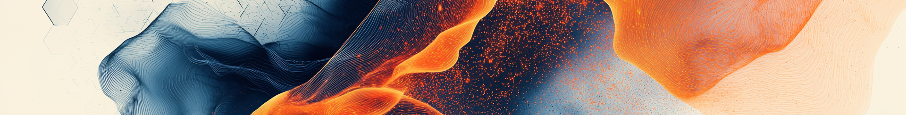

# Data Storytelling Workshop and Data Art Jam

## Event Date: January 13, 2025

### Schedule:

### Breakfast and Registration: 8:30 - 9:00 AM
### Data Storytelling Workshop: 9:00 AM - 12:30 PM
### Lunch: 12:30 - 1:00 PM
### Data Art Jam: 1:00 - 5:00 PM
### Reception (21+): 5:00 - 6:30 PM
### Location: Johnny Carson Center for Emerging Media Arts, University of Nebraska–Lincoln

The Johnny Carson Center for Emerging Media Arts at the University of Nebraska–Lincoln is excited to present the Data Storytelling Workshop & Data Art Jam on January 13, 2025. This unique event will bring together scientists, artists, technologists, and storytellers for a day of creative exploration where data meets storytelling and art comes alive.

Organized by the UNL "CreatiViz" team, the event aims to cultivate a culture of creative data visualization by transforming complex datasets into compelling visual narratives. Participants will engage in hands-on workshops, interactive data experiences, and an open art jam that celebrates the intersection of technology, creativity, information, and human expression. Through these activities, attendees will learn to weave narratives around data, employing visualizations, interactive applications, and real-world experiences to convey insights in an engaging and accessible way.

In today's data-rich, rapidly evolving landscape, the ability to effectively communicate insights derived from complex datasets is crucial. The Data Storytelling Workshop & Data Art Jam merges the rigor of data analysis with the creativity of storytelling, offering a powerful tool for conveying complex ideas to diverse audiences. Attendees will discover how to transform raw data into visual representations—such as attractive charts, engaging graphs, and interactive simulations—that inform, engage, inspire, and provoke curiosity.

This hands-on event will not only reinforce learning but also cultivate critical thinking skills, inspire curiosity, and promote informed decision-making in society. Through innovative storytelling techniques and engaging data experience design, we aim to provide a vibrant journey into the world of creative data visualization and physicalization.

***Registration is currently closed as we are at capacity. If you'd like to put your name on the waiting list, please email novysan@unl.edu directly.***

## Speakers

### Rahul Bhargava

Rahul Bhargava is an educator, designer, and artist working on creative data storytelling and computational journalism in support of goals of social justice and community empowerment. He has run over 100 workshops on data literacy, designed arts-based data murals and theatre, built award-winning museum exhibits, co-created AI-powered civic technologies with CSOs, and delivered keynote talks across the globe. Rahul’s first book, “Community Data: Creative Approaches to Empowering People with Information”, is now available from Oxford University Press.  He leads the Data Culture Group as an Assistant Professor of Journalism and Art + Design at Northeastern University.

For more: [https://dataculture.northeastern.edu](https://dataculture.northeastern.edu)

### Dr. Laura Guertin

Distinguished Professor Laura Guertin holds a Ph.D. in Marine Geology & Geophysics from the University of Miami's Rosenstiel School of Marine & Atmospheric Science and has served as faculty at Penn State Brandywine (PA) since 2001. She is an Honorary Fellow of the Geological Society of America and the American Association for the Advancement of Science. She has received additional national recognitions, as well as grant funding from the National Science Foundation to enhance teaching and student learning in undergraduate education. With a passion for science outreach, she taps into creative approaches such as quilting to engage audiences in learning about Earth science and its applications.

She is the current Big Ten Academic Alliance (BTAA) Data Viz Champion.

For more: [https://journeysofdrg.org/](https://journeysofdrg.org/)

### Matt Waite

Matt Waite is a professor of practice in the College of Journalism and Mass Communications at the University of Nebraska-Lincoln who teaches courses in AI, data analysis and visualization. He regularly speaks on and consults media organizations about the legal, ethical and journalistic complexities of using drones, data and technology. From 2007-2011, he was a programmer/journalist for the St. Petersburg Times where he developed the website PolitiFact, winner of the 2009 Pulitzer Prize for national reporting. Before that, he was an award-winning investigative reporter and co-author of Paving Paradise: Florida's Vanishing Wetlands and the Failure of No Net Loss.

### Robert Twomey

Robert Twomey is an artist and engineer exploring poetic intersections of human and machine perception, particularly how emerging technologies transform sites of intimate life. He has presented his work at SIGGRAPH (Best Paper Award), CVPR, ISEA, NeurIPS, the Museum of Contemporary Art San Diego, Nokia Bell Labs Experiments in Art and Technology (E.A.T.), and has been supported by the National Science Foundation, the California Arts Council, Microsoft, Amazon, NVIDIA, and HP. Twomey received his BS from Yale with majors in Art and Biomedical Engineering, his MFA in Visual Arts from UC San Diego, and his Ph.D. in Digital Arts and Experimental Media from the University of Washington. He is an Assistant Teaching Professor of Computing in the Arts and an Applied Imagination Faculty with the Arthur C. Clarke Center for Human Imagination at UC San Diego, where he directs the Machine Cohabitation Lab.

For more: [roberttwomey.com](roberttwomey.com) . [cohab-lab.net](cohab-lab.net)

<video autoplay loop muted playsinline style="width:100%; height:auto;">
  <source src="assets/loopEmber.mp4" type="video/mp4">
  Your browser does not support the video tag.
</video>

## [The Datasets](datasets.md)[The CreatiViz Team] (team.md)
