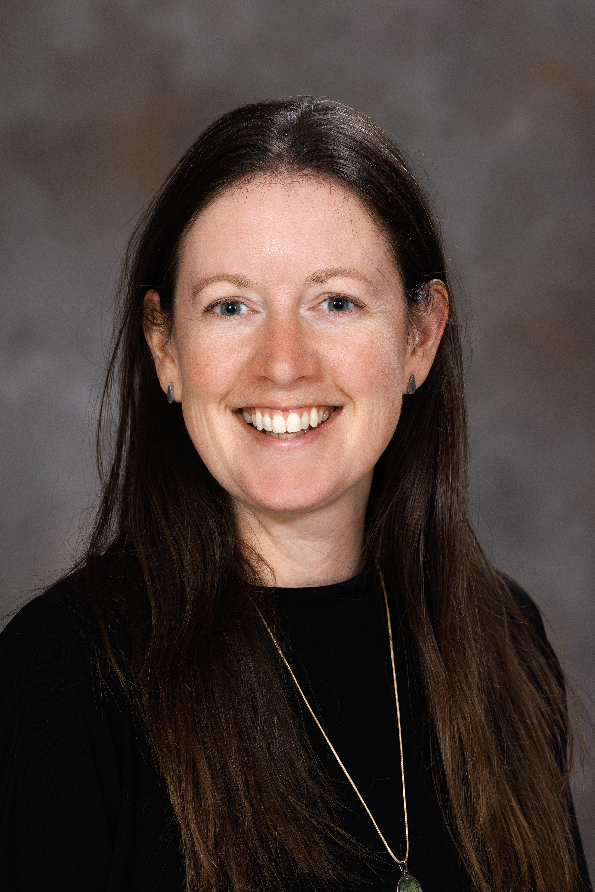
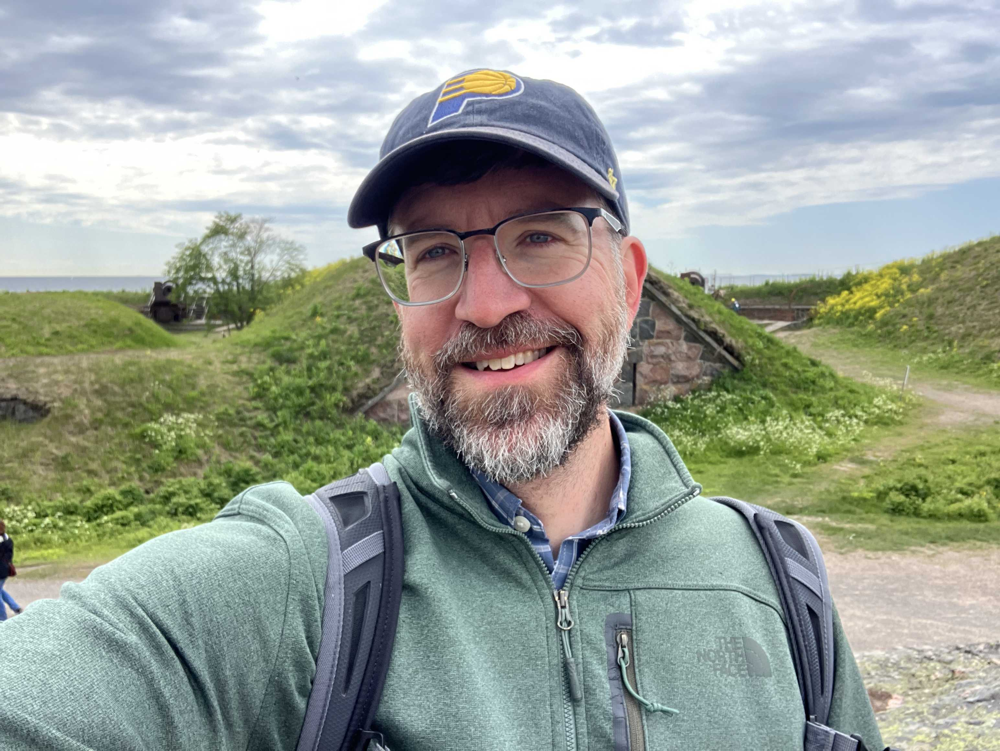
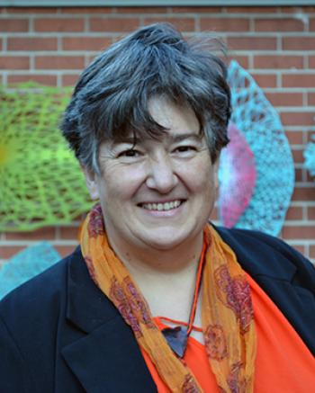
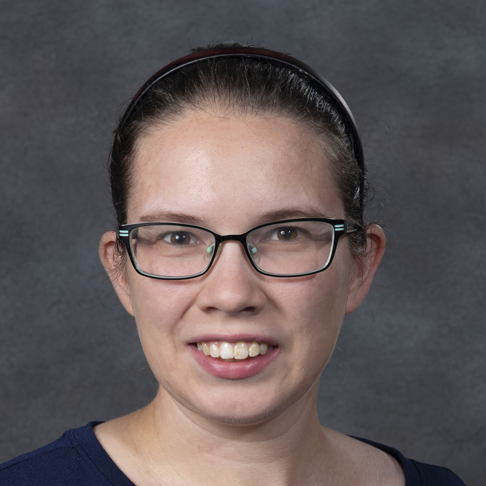

# UNL CreatiViz Team

### Chad Brassil

Chad Brassil is an Associate Professor in the School of Biological Sciences and the Faculty Director of Undergraduate Analytics for the Office of the Executive Vice Chancellor. His research spans ecological questions on the consequences of prairie plant diversity and education questions on how to visualize demographic differences in classroom student performance. 

### Jessica Corman

Jessica Corman is a limnologist and ecosystem ecologist studying how carbon, nitrogen, and phosphorus cycle through lakes, rivers, and streams. She is also interested in how arts and humanities can inform and interact with scientific research.

### Clay Cressler

Clay Cressler is a disease ecologist studying how ecological interactions of a host with its environment, including other microbes, affects the transmission and evolution of pathogens. His work often involves analyzing complex and hard-to-visualize datasets with dozens or hundreds of variables (such as measures of physiology, immunity, and microbiome).

### Heike Hofmann

Heike Hofmann is a statistician and Professor in the Department of Statistics at University of Nebraska–Lincoln and was previously at Iowa State University.

### Dan "NovySan" Novy

Professor Dan Novy, PhD, also known as NovySan, is an artist and engineer whose work spans the intersection of emergent media technologies and human experience, with a mission to bridge the divide between digital and meaningful tangible engagement. As an Assistant Professor at the Johnny Carson Center for Emerging Media Arts and a Research Affiliate at the MIT Media Lab, Novy leads the "Story Lab" and digital fabrication classes and has pioneered courses such as "Science Fiction-Inspired Prototyping" and "Indistinguishable from… Magic as Interface, Technology, and Tradition." Currently, Novy is involved in deep-ocean exploration, space analog mission simulation, synthetic characters, data visualization, and immersive experience design, working with prominent organizations such as NASA, JPL, NOAA, Disney Imagineering, Universal Creative, National Geographic, the Ocean Discovery League, and the Analog Astronaut Foundation.

### Susan Vanderplas

Susan Vanderplas is a statistician and data scientist who studies the perception of data visualization. She also works on reproducibility and data science, and develops statistical algorithms for matching and comparing forensic pattern evidence.

### **[The Datasets](datasets.md) // [Home](index.md) // [DataPhys Inspiration](https://dataphys.org/list/gallery/) // [Contact](contact.md)**

